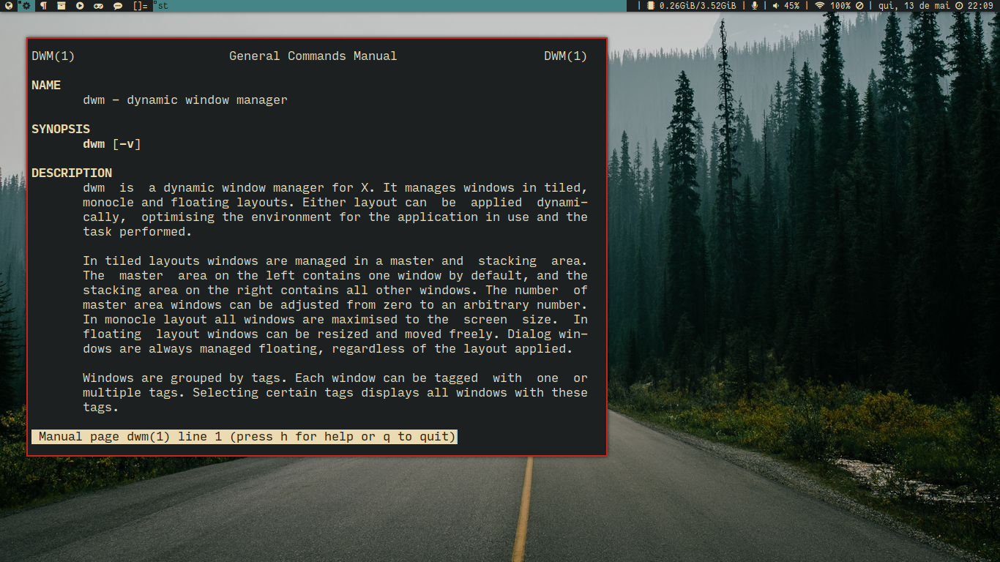

# dwm

My personal build of the Suckless Dynamic Window Manager

# Patches

- Noborder - Elimina bordas quando há apenas uma janela
- Rotate Stack - Move janelas pelo stack
- Scratchpads
- Vanity Gaps - Gaps e Layouts
- Xrdb - Lê cores de um arquivo .Xresources

